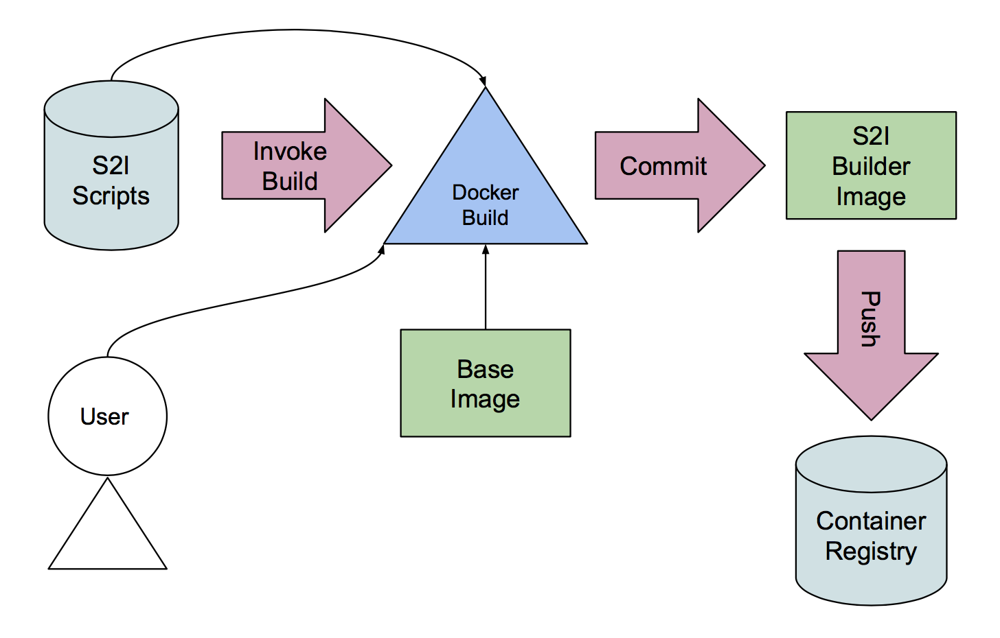

## Structure of an S2I Builder Image. 

+ _assemble_ script - this script is executed during the S2I build process and knows how to 'build' the application from source code. 
+ _run_ script - this script is executed to launch the application. 
+ _usage_ - displays the Builder Image usage information.

Have a look at the S2I files we will use to create our S2I Builder Image:

``tree builder/``{{execute}}

Have a look at the assemble script, which is responsible for 'building' your application based on the "cat" runtime. 

``clear; cat builder/s2i/assemble``{{execute}}

Notice the most important lines which create a directory to store the code and then copy the code into it.

```
mkdir -p /tmp/myapp

cp -Rf /tmp/src/* /tmp/myapp
```

This is essentially how our simple application - based on "cat" - is built!

## Create an S2I Builder Image

An S2I Builder Image can be created from any standard Docker image. 
The Dockerfile in the _builder/_ directory creates an S2I Builder Image from a base centos image. 

The diagram shows one way an S2I Builder Image can be created.



Try the following:

Look at the Dockerfile to understand how it creates a special S2I Builder Image, essentially by:

1. adding the needed S2I scripts (mainly _assemble_ and _run_) and 
2. labelling the image appropriately.

``clear; cat builder/Dockerfile``{{execute}}

## Create S2I Builder Image using Docker

Create the S2I Builder Image using the usual Docker build command (using the Dockerfile inside the _builder/_ directory): 

``docker build -t s2i-simple-builder builder``{{execute}}

Notice how the S2I script files are copied into the image:

``Step 3 : COPY ./s2i/ /usr/libexec/s2i``

The location is defined by the label:

``io.openshift.s2i.scripts-url="image:///usr/libexec/s2i"``

and, so that OpenShift knows this is an S2I Builder Image, label it such:

``io.openshift.tags="builder"``

What do you think will happen if you try to run the S2I Builder Image directly?

Try it like this:

``docker run s2i-simple-builder``{{execute}}

Notice that when "docker run" is executed against the S2I Builder Image directly (i.e.  without providing any "source code") a message is displayed describing how to use the image.  The content of the "usage" file is shown and the container stops. 

The above "docker build" command creates the image but only stores it into the local docker storage and not into a Docker registry. This time we'll do the exact same docker build inside Openshift which will push the image into the internal registry for us. 

## Create S2I Builder Image using OpenShift

First, we need to create the Build Configuration which knows how to build our S2I Builder Image (using the Docker build strategy).  ``--binary=true`` simply means we will upload the Dockerfile and the S2I scripts needed for the build from a local directory. 

Run the below commands:

``oc new-build --name s2i-simple-builder --binary=true``{{execute}}

Start the build using the content of the local _builder/_ directory, following the progress and waiting for completion.

``oc start-build s2i-simple-builder --from-dir=builder --follow --wait``{{execute}}

If all went well, the new S2I Builder Image (s2i-simple-builder) has been created and pushed successfully into the registry.  Notice the exact same output as the "docker build" command we ran earlier and the image is pushed into the internal registry.  You should see a "Push successful" message. 

## Examine the Builder Image Stream

Now, have a look at the newly created Image Stream which references and tracks the S2I Builder Image in the registry.  

``oc get is``{{execute}}

``oc describe is s2i-simple-builder``{{execute}}

Should the Builder Image be updated, fresh application image builds can be automatically triggered through this Image Stream. 

Switch your role now to that of a developer. The S2I Builder Image has been provided to you by your Technical Leader and can now be used to create a runtime image containing your application.  Continue to the next step to build and run your own simplified application. 


