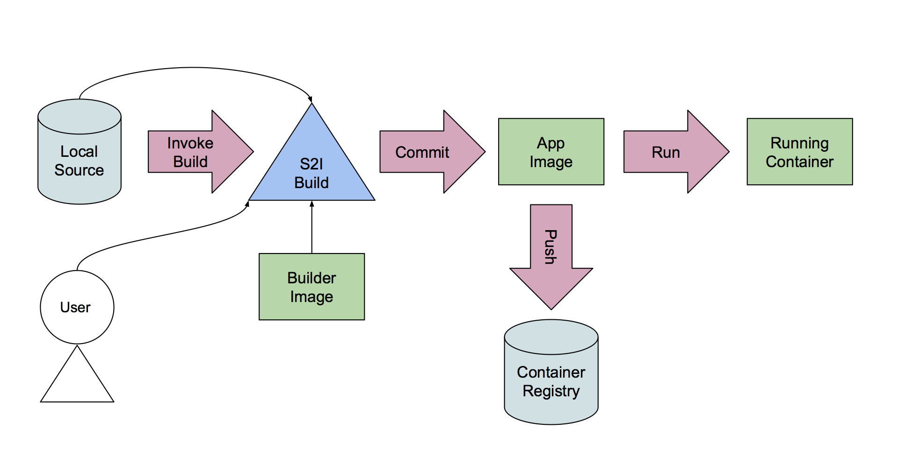

Before we get started, you need to login and create a project in OpenShift
to work in.

To login to the OpenShift cluster used for this course from the _Terminal_,
run:

``oc login -u developer -p developer``{{execute}}

This will log you in using the credentials:

* **Username:** ``developer``
* **Password:** ``developer``

You should see the output:

```
Login successful.

You don't have any projects. You can try to create a new project, by running

    oc new-project <projectname>
```

To create a new project called ``myproject`` run the command:

``oc new-project myproject``{{execute}}

You should see output similar to:

```
Now using project "myproject" on server "https://172.17.0.41:8443".
...
```

The Source-To-Image (S2I) tool comes fully integrated with OpenShift.  S2I is especially useful for developers as it can shield them from the details of creating Docker images.  

Two of the main reasons to use S2I are:

1. Developers can get up and running with Linux containers without knowing much (if at all) about Docker itself.  This is great for Developers who just want to get their code running in a Linux container.
2. Enterprises need more control over how their teams build images and don't want to allow developers the freedom to install anything they choose (as root) into container images.  The S2I process constrains somewhat how the user builds images and does not allow anything to be installed during the S2I process using root privileges. 

So, for this scenario, imagine you are a Lead Developer or an Operations Lead and want to create a way for your developers (OpenShift users) to easily and securly create docker images containing their applications. 

# The Simplified Runtime

For this scenario we will avoid any complications with specific runtimes and/or languages and their build processes and use a very simple runtime.

The application "runtime" we will use is represented by the Linux command "cat" which simply displays the contents of files.

Our S2I Builder Image's runtime will contain the command "cat". To create an application image, the developer need only pass files ("source code") during the build process. 
The Builder container will know where to place the source code so that it can be later "executed" by the runtime "cat".

# The S2I Build Process

The S2I Builder Image contains the scripts needed to first build the application and then to run the application.



In the simplist case, the process of building the application image is as follows:

1. Instantiate the S2I Builder Image (this can be triggered automatically by a code change or by the user).
2. Copy the source code into the running container. 
3. Execute the _assemble_ script to build the source code to create the application. 
4. Commit the container to create the new image.

# Running the Application Image

When the resulting application image is instantiated, the _run_ script executes the _cat_ command to display the contents of any "source code" stored inside the image. 

